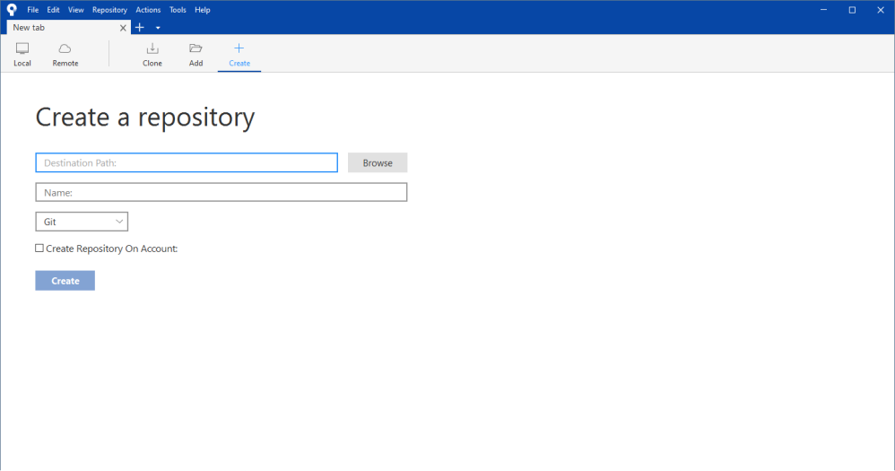
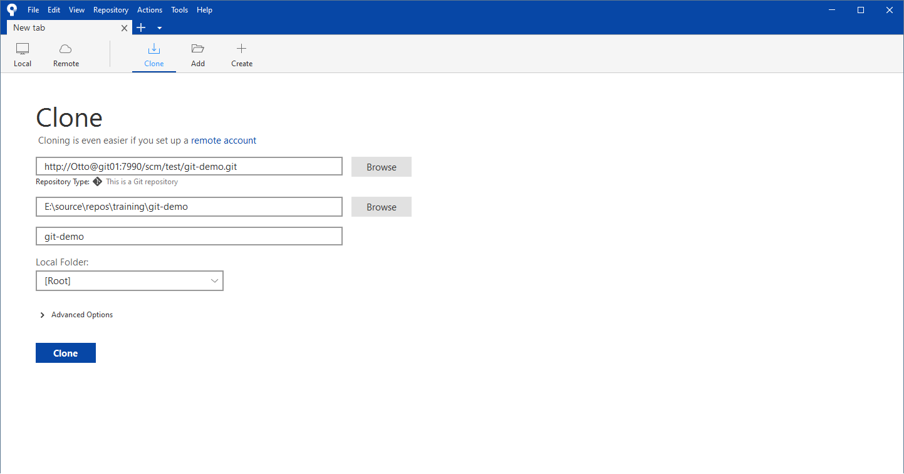
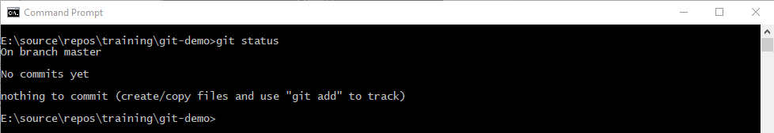
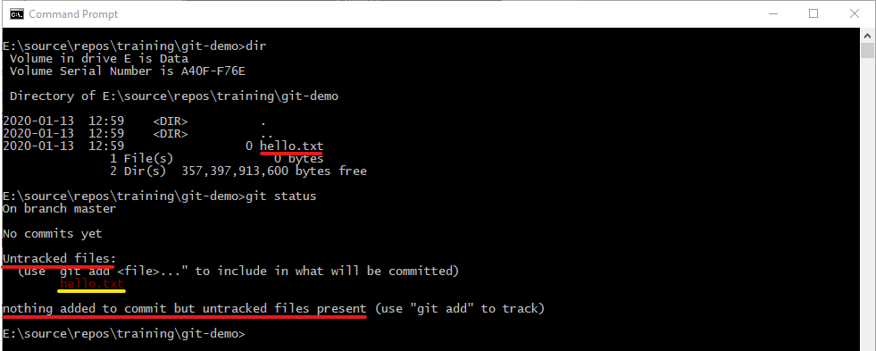
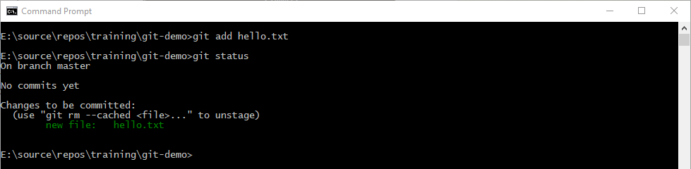
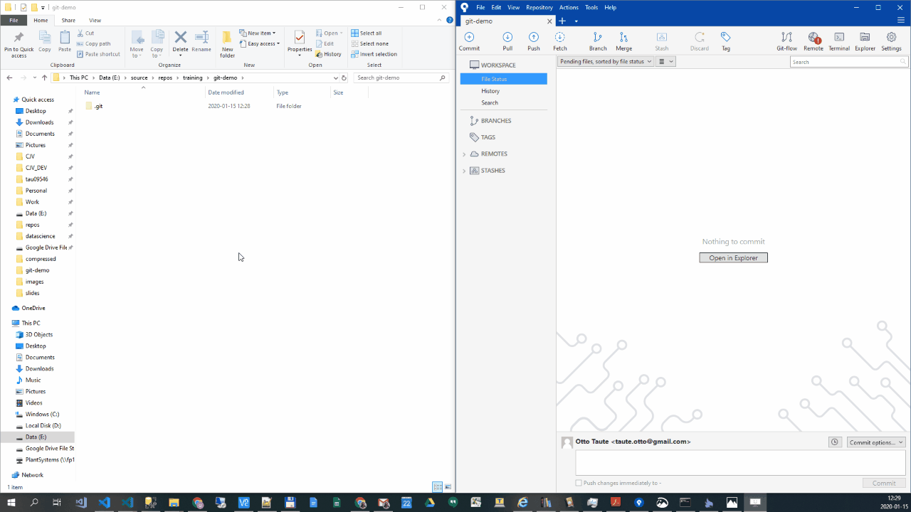
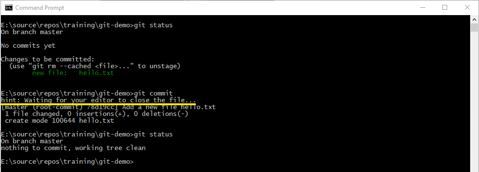
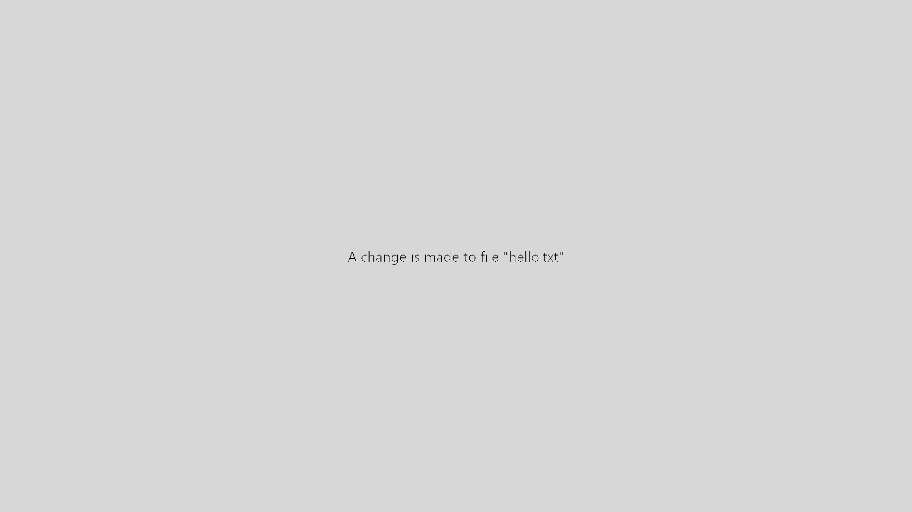
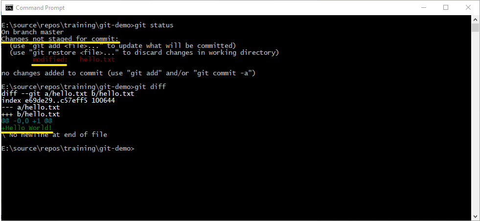

# What is Git?

Git is a *Distributed Version Control System*. This differs significantly from the more traditional *Centralised Version Control Systems* (such as SourceSafe).

Git also models data differently to most version control systems. Where most version control system model data as a set of changes to files, Git models data as a series of file-system snapshots.

---

## Centralised VCS {data-transition="slide"}

* Traditional VCS are centralised
  * All files are kept on the server
  * History is only kept on the server
* Interaction with the server and managed files is through a client or IDE integration
* The same file cannot be edited by different people at the same time
* Server failure risks the loss of the files and the *file history*

---


## Distributed VCS {data-background=#ff0000 data-background-transition="slide"}

* Each repo contains all of the files
* Each repo contains the **entire history** of the files
* Local repo is an **exact mirror** of the remote
* There is no difference between the version control program running on the server vs. locally
* Can be used without a remote being defined
* Much faster and more reliable than a CVCS

---


## Git's data model

* Almost all other version control systems use a *delta-based* model
  * A set of files
  * Changes made to these files over time (deltas)
  * Latest version is the initial version **with all of the deltas applied**
* Git models information as a series of file-system **snapshots**
* Every commit generates a new snapshot
  * Stored using a 40-character SHA1 hash as an id
* This forms a complete image of how the file-system looked at the time of the commit
* Unchanged files are stored as a soft link to their equivalent in the previous snapshot

---


## Git's change model

* Changes *inside* a file can form a separate commit
* Conceptually unrelated changes can be made at the same time
  * Will not necessarily form part of the same commit
* Delta-base version control checks in the entire file (with all changes)
  * Cannot check in partial changes
* In order to be able to commit different file changes as different commits, Git introduces a separate area called the *Staging Area*

---

## Git areas


* Changes in the *Working Directory* are tracked (the file shows as **modified**)
* Individual changes can be **staged** into the *Staging Area*
* Staged changes can be **committed** to the repo
* Changes that are in the *Working Directory*, but not the *Staging Area* are not committed in the current commit

# Git basics

This section provides examples of the most basic operations in Git. Examples are provided from the command line, as well as in the [Sourcetree](<https://www.sourcetreeapp.com/>) GUI.

The following examples are provided:

1. How to create a new repo
2. How to clone an existing repo
3. How to make and store changes
4. How to view the commit history
5. How to undo work
6. How to tag commits

---

## Creating a new repo

* The command for creating a new (empty) repo is `git init`.
* This command is executed from the directory in which you want a repo to be created.
* A `.git` directory is created, which contains all of the necessary repo files.

```bash
~/git-demo$ git init
Initialized empty Git repository in ~/git-demo/.git/

~/git-demo$
```

---

The same can be achieved in Sourctree

* Click on "`File->Clone/New`" or choose "`Local`" from the repo tab and click "`Create`"
* Fill in the directory and repo name (defaults to directory name)
* Repo is created and opened in Sourctree



## Cloning a repo

* A clone is a copy with a link to the source repository
* It is an exact copy
  * All files
  * All file history
* Can be any repo for which you have a valid, reachable url
  * Usually exposed by a server (such as Bitbucket or GitHub) as an `http` or `https` endpoint
  * Sometimes exposed through `ssh`
  * Can also use the `git` protocol
* Creates a directory for the repo automatically

```bash
~$ git clone http://user@server/git-demo.git
Cloning into 'git-demo'...

~$
```

---

In Sourcetree, click on "`File->Clone/New`" or click on "`Clone`" from the repo tab. Then specify the remote url and local destination directory in the dialog.



## Making and storing changes

* Git does not automatically track new files added to the repo directory
* The file has an initial status of "`untracked`"
* Need to instruct Git to track the file (status changes to "`tracked`")
* Tracked files can have a status of
  * "`unmodified`" (no changes between working directory and repo)
  * "`modified`" (working directory is different to repo)
  * "`staged`" (file is in staging area, ready to be committed)
* Typical lifecycle of a file is *untracked*->*staged*->*unmodified*->*modified*->*staged*->*...*

---


---

### Commands to interact with files and the repo

* `git status` (shows the current status of files and the repo)
* `git add <pattern>` (stage all files matching the pattern)
* `git diff` (shows the difference between the working directory and the repo)
  * `git diff --staged` (shows the difference between the staged file(s) and the repo)
* `git commit` (commits the staged changes to the repo)
* `git rm` (untrack the file and delete from working directory)
* `git mv` (move the file to a different directory, history is kept)

---

### Repo status





---

### Tracking a file

* Start tracking a file using "`git add <pattern>`" e.g. 
  * "`git add .`" to add all files in the current directory.
  * "`git add hello.txt`" to add only the specific file
* File is moved to staging area, ready to be committed



---



---

### Committing a change

* Use the command "`git commit`"
* Every commit **must** have a commit message
  * A short message describing the change
  * Written in the imperative tense (i.e. "Add", not "Added" or "Adding")
  * Aims to complete the sentence: *"When applied, this commit will..."*
  * Read about good commit messages in [A note about git commit messages](<http://tbaggery.com/2008/04/19/a-note-about-git-commit-messages.html>)
* Git opens the default text editor to allow you to edit the commit message
* Can commit with a short message by using the `-m` option
  * "`git commit -m "Add file hello.txt"`"

---



---



---

### Seeing what will change

* Once a file is tracked, Git picks up any modifications made to the file
* See which files have been modified by using "`git status`"
* See the difference between the working directory and the repo by using "`git diff`"
  * Shows what has been added
  * Shows what has been removed
  * Shows what has been modified
* Once changes have been staged, use "`git diff --staged`" to see the difference between the staging area and the repo



---

### Ignoring files

* Git can be instructed to ignore a file
  * Will not show up as untracked
* First create a `.gitignore` file in the project directory (not in the hidden `.git` directory)
* File name patterns in this file are ignored by Git
  * Standard glob patterns are applied recursively throughout the working tree
  * Comment lines start with `#`
  * Patterns starting with `/` are not applied recursively
  * Patterns ending with `/` specify entire directories
  * Patterns starting with `!` invert the pattern
  * Common to ignore compiled files (e.g. `*.dll, *.exe`)

---

Here is an example:

```text
# ignore all .a files
*.a

# but do track lib.a, even though you're ignoring .a files above
!lib.a

# only ignore the TODO file in the current directory, not subdir/TODO
/TODO

# ignore all files in any directory named build
build/

# ignore doc/notes.txt, but not doc/server/arch.txt
doc/*.txt

# ignore all .pdf files in the doc/ directory and any of its subdirectories
doc/**/*.pdf
```

---

### Removing files

* Sometimes it is necessary to delete a file and instruct Git to no longer track the file
* Use the "`git rm <pattern>`" command to achieve this
* The file is not deleted from the history
* Restoring a previous snapshot will also restore the file as it was at the time of that commit

---

### Moving files

* Sometimes it is necessary to move a file to a different directory in the project
* Moving a file in the OS is equivalent (from Git's perspective) to deleting the file and creating and identically named file elsewhere
* Rather use the "`git mv <source> <destination>`" command
  * Git interprets this as a rename
  * The file history is preserved

This is equivalent to the following:

```bash
# first move the file without Git's help
~/git-demo$ mv hello.txt hello.md

# then remove the old file and track the new file
~/git-demo$ git rm hello.txt
~/git-demo$ git add hello.md
```

## Viewing the commit history

## Undoing work

## Tagging commits